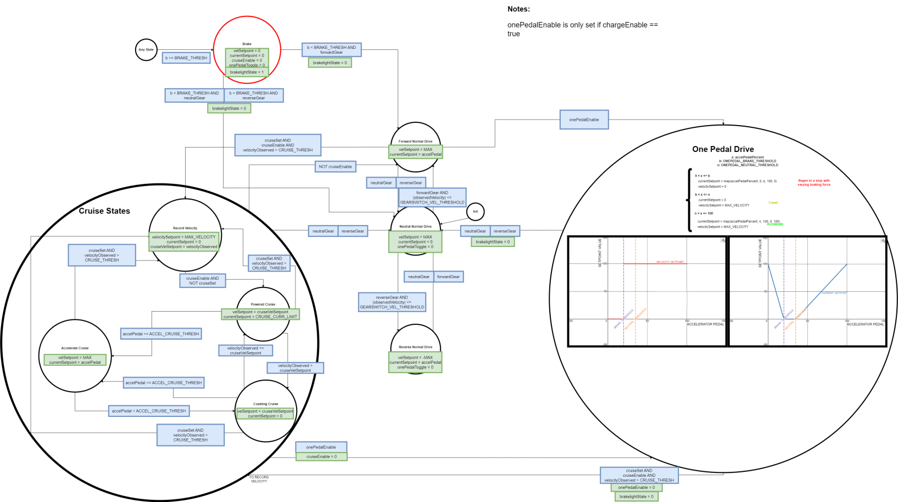

********************
SendTritium Task
********************

The SendTritium task currently houses our velocity control code. 
It utilizes a FSM to coordinate what messages should be sent to the motor controller depending on a certain set of input variables.
This FSM depends on data from across the system, such as:

* The Pedals
* The switches
* The CAN messages from BPS (indicates whether we can regen brake or not)

Implementation Details
======================
The FSM has three major supermodes, which are:

* "Normal" (Current Controlled) mode. This includes the Forward, Neutral, and Reverse states.
* One Pedal Drive (Velocity Controlled) mode. This is the state where the driver is only using the accelerator pedal to control the car.
* Cruise Control (Velocity Controlled) mode. This is the state where the driver is using the cruise control buttons to control the car. This includes the Record Velocity, Powered Cruise, Coasting Cruise, and Accelerate Cruise states.

The FSM also includes the brake state.

FSM Diagram
===========

API
===
.. autodoxygenfile:: SendTritium.h
   :project: doxygen
