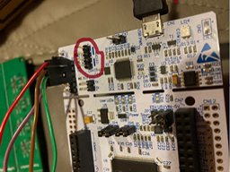
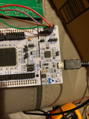
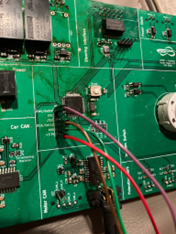
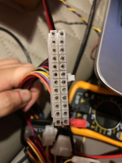
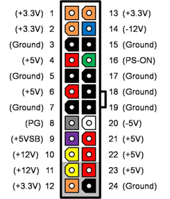

# Controls
This repository contains all code related to Longhorn Racing Solar's Controls System

## Documentation
Controls documentation is hosted on [Read the Docs](https://controls-docs.readthedocs.io/en/latest/). Make sure to update the documentation as new features are implemented. The link always points to the most up-to-date docs i.e. whatever is on the master branch.

## Setup
There is currently one option to develop the Controls system. This option is to use a terminal in a linux environment to build and flash the program.

### Setup for Terminal Development
The system can be built and deployed from a terminal.
1. Ensure that you have some type of linux machine such as Ubuntu, Windows Subsystem for Linux, etc. Windows will not work.
    - A Linux Virtual Machine is highly recommended. You will not be able to flash code onto the board with WSL.
    - Use this link to download the Ubuntu Server image: [Ubuntu Server 22.04 Install](https://releases.ubuntu.com/22.04/)
    - Once the server is set up, you can ssh into it (basically connecting your development environment on the host machine to the code on the virtual machine). Ask another experienced member/lead to help you out with this step.
2. Download [VSCode](https://code.visualstudio.com/)
3. Clone the repository and its submodules with: 
```git clone --recurse-submodules https://github.com/lhr-solar/Controls.git``` 
4. Run install.sh to install the appropriate dependencies for both microcontroller and simulator development.
    - The install script will not work on systems that do not use the apt package manager. Please ask a lead to help install if you have a system without apt. 
5. In VSCode, download the following extensions (Click on the block icon on the left column):
    - C/C++
    - ARM
    - cortex-debug

## Building
When calling any of the following commands, make sure you are in the Controls folder.

Call ```make bsp_type``` to compile the release version of the code. ```bsp_type``` is the system you want to compile for.

Call ```make help``` for more information on how to build the project.

Call ```make clean``` if the build fails for any reason other than syntax related.

For testing, please read the Testing section.

## Testing
The following testing information is speficially for terminal development.

### Rules for making a new test src file
1. Test names: The formatting of the file names is crucial to have the makefile work properly. "Test_" should be the prefix and the src file name that is to be tested must follow i.e. if you want to test x.c, the test src file must be named Test_x.c or the makefile will not be able to find the file.
    E.g. A test for Dashboard.c should be Test_Dashboard.c file, a test for BSP_CAN.c should be named Test_BSP_CAN.c
2. All test files should be placed into the Tests folder.

### How to build a test
To build a new test, you need to use the following command:
```make bsp_type TEST=x```

- ```bsp_type``` specifies which system you want to compile the code for: ```stm32f413```, ```simulator```
- ```x``` specifies which test you want to compile. TEST= is optional and only required if a test is to be compiled. Set TEST equal to the suffix of the Test_ src files i.e. if the test you want to run is in Test_x.c, set TEST=x.
    E.g. Call ```make stm32f413 TEST=Dashboard``` if you want to test Dashboard.c with the Test_Dashboard.c src file

## Setting up the Leaderboard/Nucleo Board
* We have an STM32 nucleo board whose only prupose is to flash and debug code to the leaderboard.
    - Note: Normally, the nucleo's programmer is wired to the nucleo board itself. Thus, it is necessary to remove the pair of jumpers on the nucleo board programmer to use it for an external chip. Picture of where the jumpers to remove is shown below.

    - 
* To connect the JTAG connections on the nucleo's programmer to the leaderboard, follow the pictures below. Starting from the top of the nucleo board, pin 1 is VCC, pin 2 SCK, pin 3 is GND, and pin 4 is SWO.
    -  
* If you're using a power supply, simply connect +12V and GND to the leaderboard.
* If you're using a power supply (PSU for computers), you can find the 24 pin connector on the PSU and use the +12V and GND from there to power the leader board. This would be pin 11 (+12V) and pin 24 (GND). We would also need to pull PS-ON to GND for the power supply to turn on. We can short pin 3 (GND) and pin 16 (PS-ON) to do this. See pictures below
    -  

## Extending Partition and Filesystem
There is an issue where if you run out of space on your VM, stuff stops working. In this case, you need to add space to your virtual disk, create a partition, extend your main partition and tell the file system to reflect this. The following are steps from this [website](https://www.techrepublic.com/article/extending-partitions-on-linux-vmware-virtual-machines/) on 2/11/2023. Note: The volume group for ubuntu should be `ubuntu-vg` and the logical volume (volume/lv) should be 'ubuntu-lv`. Note: The steps refrence the Figure A/B/C. Ignore it. The figures are gone 😢

1. Shutdown the VM
2. Right click the VM and select Edit Settings
3. Select the hard disk you would like to extend
4. On the right side, make the provisioned size as large as you need it
5. Click OK
6. Power on the VM
7. Connect to the command line of the Linux VM via the console or putty session
8. Log in as root
9. The fdisk command provides disk partitioning functions and using it with the -l switch lists information about your disk partitions.  At the command prompt type `fdisk -l`
10. The response should say something like Disk /dev/sda : xxGB. (See Figure A)
11. At the command prompt type fdisk /dev/sda. (if dev/sda is what was returned after step 10 as shown in Figure A)
12. Type p to print the partition table and press Enter (also shown in Figure A)
13. Type n to add a new partition
14. Type p again to make it a primary partition
15. Now you’ll be prompted to pick the first cylinder which will most likely come at the end of your last partition (ex: /dev/sda3 ends at 2610).  So I chose 2611 for my first cylinder, which is also listed as the default.
16. If you want it to take up the rest of the space available (as allocated in step 4), just choose the default value for the last cylinder.
17. Type w to save these changes
18. Restart the VM
19. Log back in as root
20. At the command prompt type fdisk -l. You’ll notice another partition is present.  In Figure B it is listed as sda4.
21. You need to initialize this new partition as a physical volume so you can manipulate it later using the Logical Volume Manager (LVM).
22. Now you’ll add the physical volume to the existing volume group using the vgextend command. First type `df -h` to find the name of the volume group.  In Figure C, the name of the volume group is vg_root. Now type `vgextend [volume group] /dev/sdaX`. (ex: vgextend vg_root /dev/sda4)
23. To find the amount of free space available on the physical volume type `vgdisplay [volume group] | grep “Free”`
24. Extend the logical volume by the amount of free space shown in the previous step by typing `lvextend  -L+[freespace]G /dev/volgroup/volume`. (ex: lvextend -L+20G /dev/vg_root/lv_root)
25. You can finally expand the ext3 file system in the logical volume using the command `resize2fs /dev/volgroup/volume` (ex: resize2fs /dev/vg_root/lv_root).
26. You can now run the `df -h` command to verify that you have more space

## Rules
Commit frequently into your own branches. Create a Pull Request whenever you are ready to add you working code to the master branch. You must select 1 reviewer for approval. Follow the coding guidelines in the Solar SharePoint. The reviewers will make sure everything is up to par with the coding standards.

### Using GDB:
NOTE: The below is one way to debug the program. GDB is not that compatible with debugging the code so another method of debugging is also available.
GDB is a debugger program that can be used to step through a program as it is being run on the board. To use, you need two terminals open, as well as a USB connection to the ST-Link programmer (as if you were going to flash the program to the board). 
1. In one terminal, run ```st-util```. This will launch a program that will interface with the board. 
2. In the other terminal, start gdb with the command ```gdb-multiarch ./Objects/bps-leader.elf``` (assuming that you are doing this in the root of the project directory.
3. This will launch GDB and read in all of the symbols from the program that you are running on the board. In order to actually connect gdb to the board, exectue the command ```target extended-remote localhost:4242```, which will connect to the st-util command from earlier.
### Using OPENOCD
OpenOCD is another debugger program that is open source and compatible with the STM32F413. 
1. Run ```st-util``` in one terminal.
2. Replace step 2 above with ```./openocd-debug.sh```.
3. Replace step 3 above with ```target extended-remote localhost:3333```
**Note:** If you get an error message for Permission denied, try giving openocd read/write permissions using chmod: ```chmod 764 openocd```
https://linuxcommand.org/lc3_lts0090.php
## Rules
Make sure to have fun!
Commit frequently into your own branches. Create a Pull Request whenever you are ready to add you working code to the master branch. Make sure that your code compiles without any errors or warnings before you open a pull request. At least one approver must approve your pull request before it can be merged. The reviewers will make sure everything is up to par with the coding standards.
### Code Reviews
You can review a pull request even if you are not an approver. In addition to helping us catch bugs, code reviews are a good opportunity to learn more about the BPS codebase. Some examples on what you can include in a code review are:
- Ask why the author wrote a certain part of code in a way they did
- Point out potential bugs in the code
- Point out that part of the code is not well documented or hard to read
You can either approve, comment, or request changes at the end of your pull request. These are the scenarios in which I would use each option:
- **Approve:** You are signing off that this pull request is ready to merge. You and the pull request author "own" this part of the code now.
- **Request Changes:** You have found problems with the code that must be addressed before it can be merged. Note that this will block the pull request from merging until you re-review the code.
- **Comment:** Do this if you do not want to explicitly approve or request changes.


Reviewers:
1. Sidharth Babu
2. Roie Gal
3. Ishan Deshpande
4. Nathaniel Delgado
